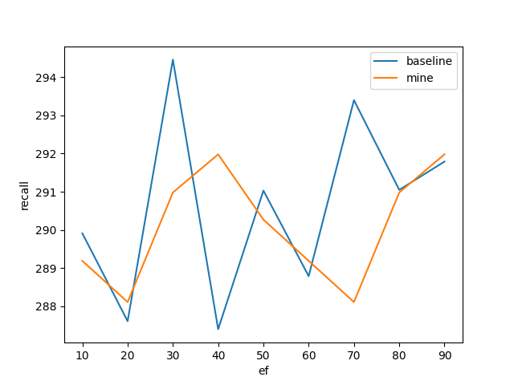
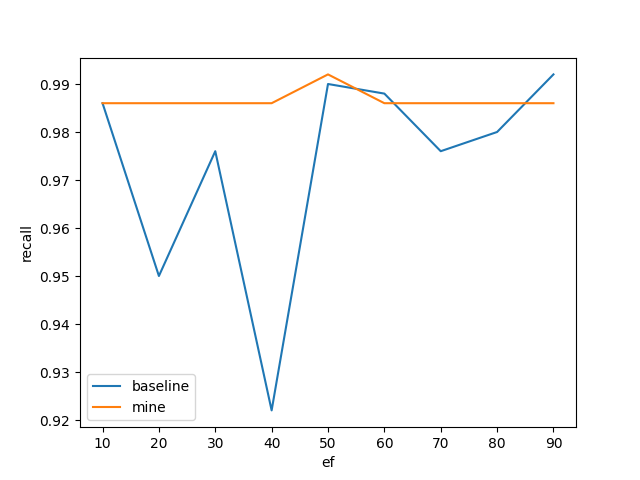
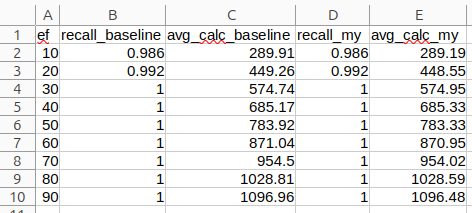

# Navigable Graphs Python
I tried to change number of levels.
Plots for graphs with different ef values:

Values for graph with ef = 10, but recall calculated with values from 10 to 90:

Method "count_connected_components" was added to class HNSW.

