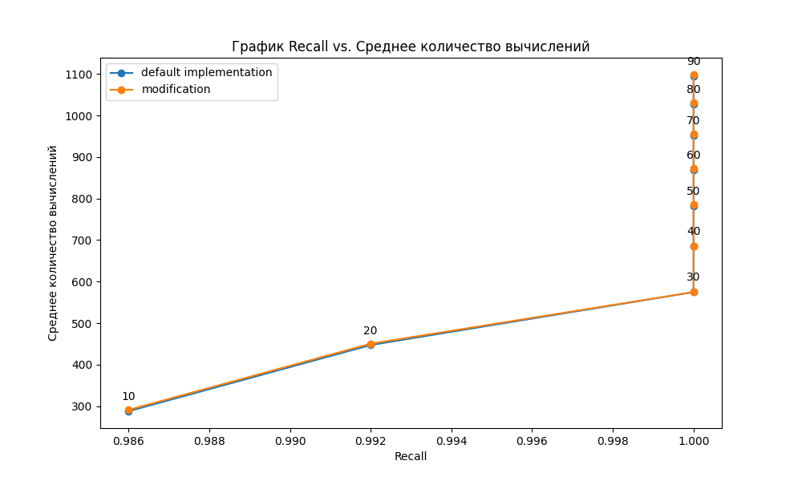

# Navigable Graphs Python
## Внесенные изменения
В данной лабораторной работе проходили эксперименнты с подбором параметров для hnsw графа. В частности, какие-то относительно положительные результаты удалось получить благодаря увеличению числа уровней.

## Результаты

Таблица с полученными знаечниями 10 to 90:
|ef |recall |avg_calc|recall_my|avg calc_my|
| - | ----- | ------ | ------- | --------- |
|10 |0.986  |289.91	 |0.986	   |289.19     |
|20 |0.992  |449.26	 |0.992	   |448.55     |
|30 |1      |574.74	 |1	       |574.95     |
|40 |1      |685.17	 |1	       |685.33     |
|50 |1      |783.92	 |1	       |783.33     |
|60 |1      |871.04	 |1	       |870.95     |
|70 |1      |954.5	 |1	       |954.02     |
|80 |1      |1028.81 |1	       |1028.59    |
|90 |1      |1096.96 |1	       |1096.48    |

Из таблицы становится ясно, что при одинаковых значениях recall, значения avg_calc не сильно изменились, но все же в 7 случаяз из 9 случаях среднее число вычислений удалось сократить.

## Подсчет числа компонент связностей
Method "count_connected_components" was added to class HNSW.

